## DRR

[1.DRR-正向投影_drr投影-CSDN博客](https://blog.csdn.net/qq_37806107/article/details/117323493)

### 正向投影

#### 像素驱动

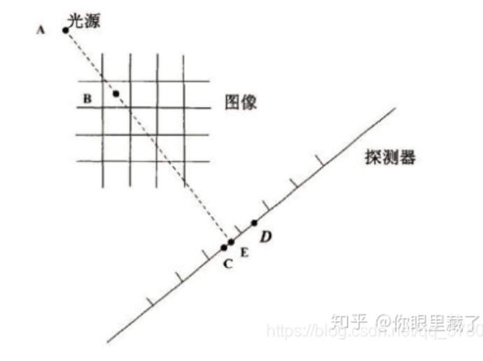

假设X射线源为点A，图像像素值在像素中心位置，探测器检测到的投影数据值在探测器的中心位置。

正投影：连接光源A和图像的各个像素的中心位置B，到达探测器的E点。将光线上的像素点的值累加到探测器E点的像素值（其中会涉及射线经过像素的权重参数）。

反投影：像素驱动的反投影过程就是连接光源A和图像的各个像素的中心位置B，到达探测器的E点，反投影过程中，探测器检测到的投影数据是已知的（图中C、D两点的位置及投影数据都是已知量）所以，采用插值的方法即可求得点E的值。利用多个角度的图像，进而计算出B点的像素值。

### 射线驱动

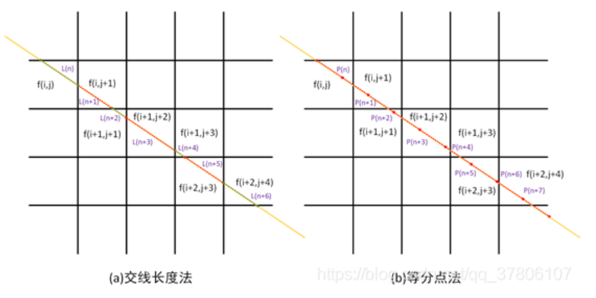


图1：   (a) 等分点法          (b)交线长度法

（1）等分点法

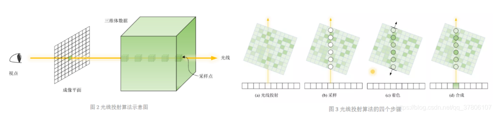

等分点法：直接给出一系列射线上点的坐标，对坐标的值进行累加。例如图1(a)所示，以等间距的采样，给出一系列的点，利用每个点的临近已知点计算出其对应的值，。比较经典的算法有最邻近算法（选取最邻近的已知点的值作为当前点的值）与插值算法（选取不同方向上的最邻近已知点的值进行插值作为当前点的值）。
（2）交线长度法

计算射线穿过每个网格的长度（△t），再进行离散积分计算积分值再进行累加，图1(b)所示。

二者在一定程度上可以进行关联。例如在交线长度法方法中，当确定每个网格下的长度后，利用高斯积分获取当前网格的积分值再进行累加。等价于在等分点法中，等间距的 [公式] 取到无穷小，进一步利用插值方法获取每个点的值。

### 距离驱动

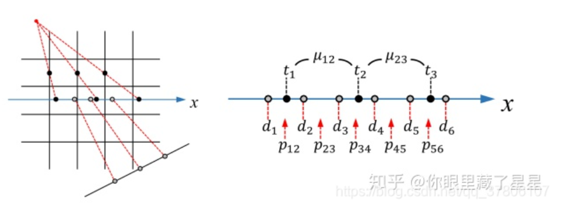

连接源点和像素的边界中点交X轴于ti，连接探测器与源点交X轴于di，μ和p分别表示像素值和投影值。


### 线模型：可分离的足迹（Separable Footprints）

《3D Forward and Back-Projection for X-Ray CT Using Separable Footprints》(Yong et al., T-MI)
$$
q(s,t,\beta;x,y,z)\triangleq v(s,t,\beta)u(\beta;x,y)\tilde{F_1}(s,\beta;x,y)\tilde{F_2}(t,\beta;x,y,z).
$$


•˜F1：轴方向的梯形足迹函数（沿行）

•˜F2：轴向矩形足迹函数（沿列）

•u(b ; x, y)：体素相关振幅函数

•v(s, t, b )：射线相关振幅函数

### 线模型：可分离的足迹（Separable Footprints）

《Forward and Back-Projection for X-Ray CT Using Separable Footprints》研究中将体素的足印函数近似为两个二维足印函数的乘积；q*a;

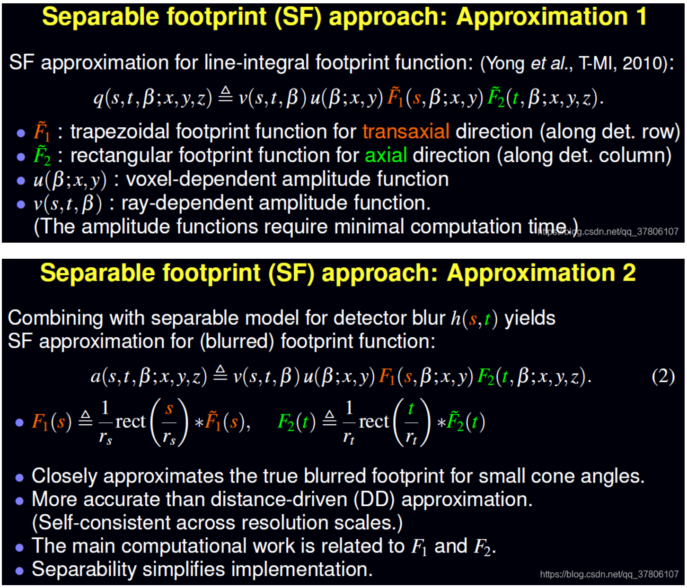

### 面模型

面积模型（3D体积模型）的提出则避免了插值的过程，更好的近似真实投影模型中射线从理想光源到理想探测器中的积分，有效地保持了重建精度。

区域积分模型，该模型是通计算每一个像素与每一条射线之间相交区域积分以及标准化因子，来得到每一个像素对于投影的贡献：

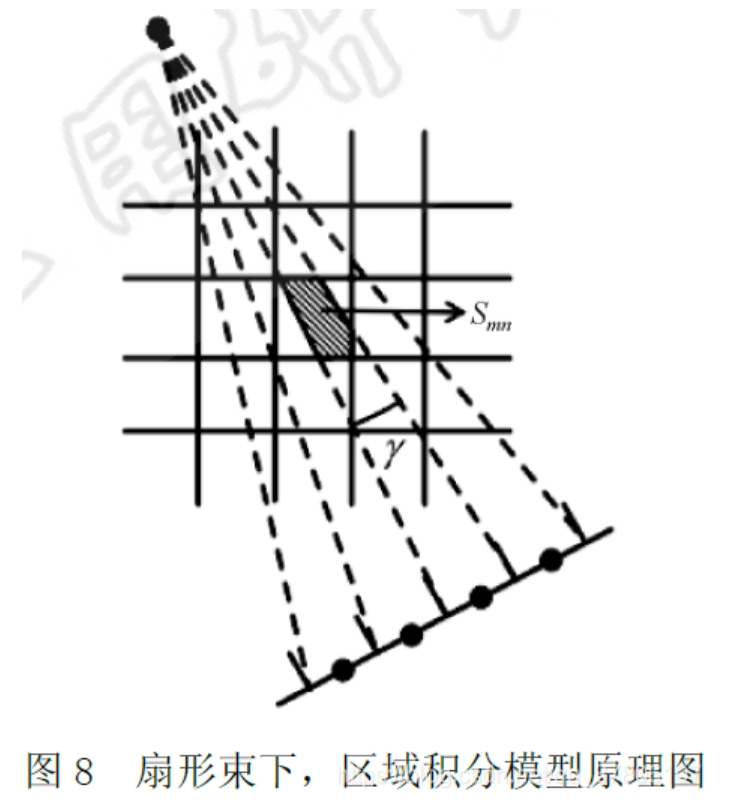


### 基函数模型

基函数模型的提出是为了更好模拟出真实射线与物质作用生成投影的规律，如射线的“锥束”引起的近光源与远光源作用的不一致性、单个体素值的连续空间分布以及单个体素对多个像素影响等特征和现象。基函数模型刻画投影矩阵的计算较为复杂。基函数模型的研究比较多，构造方法也各有不同，例如立方体模型、傅里叶级数模型[25]、小波模型球体（或圆盘）重叠模型[27]、Kaiser-Bessel 窗函数模型[28]、自然像素模型[29]、B-splines模型、狄拉克冲激函数模型和高斯函数模型等等。
参考：

《CT重建中投影矩阵模型研究综述》

《PET-CT图像重建技术综述》

《基于ITK的数字重建放射影像重建算法与应用》

《SFM：Forward and Back-Projection for X-Ray CT Using Separable Footprints》

《Distance driven projection and back-projection in three dimensions》

《GPU accelerated voxel-driven forward projection for iterative reconstruction of cone-beam CT1》


## DRR 生成代码


[CUDA_DigitallyReconstructedRadiographs/SiddonClassLib/src/SiddonLib/siddon_class.cu at master · fabio86d/CUDA_DigitallyReconstructedRadiographs (github.com)](https://github.com/fabio86d/CUDA_DigitallyReconstructedRadiographs/blob/master/SiddonClassLib/src/SiddonLib/siddon_class.cu)


## 相机模型

[相机模型、参数和各个坐标系(世界坐标系、相机坐标系、归一化坐标系、图像坐标系、像素坐标系之间变换）_相机坐标系和归一化坐标系-CSDN博客](https://blog.csdn.net/qq_40918859/article/details/122271381)

[OpenCV: Camera Calibration and 3D Reconstruction](https://docs.opencv.org/4.x/d9/d0c/group__calib3d.html)

### 相机模型

相机成像，即将三维世界中的坐标点（单位：m mm）映射到二维图像平面（单位：p i x e l pixelpixel）。这个过程可以用一个几何模型进行描述，其中最简单且有效的是针孔模型。

#### 针孔模型

图一是针孔成像模型的几何模型，***相机坐标系* ** 为$O-x-y-z$ ，设现实中的一点$P$的坐标为$[X,Y,Z]^T$ ，经过小孔$O$ 投影到相机物理成像平面$P'$ 点，其坐标为$[X',Y',f]^T$ ，$f$ 为相机焦距，根据相似三角形原理可以得到$\frac{Z}{f}=-\frac{X}{X'}=-\frac{Y}{Y'}$ ，其中负号表示倒像。

> 实际成像平面就应该是倒向，但是一般的数码相机呈现的图片都是正向的，这是因为数码相机 呈现的图像是经过翻转的。

那么我们也可以简化模型，将成像平面前移$2f$ ，如图所示这样就可以去掉负号得到$\frac{Z}{f}=\frac{X}{X'}=\frac{Y}{Y'}$

整理得：$X' = f \frac{X}{Z}, Y' = f \frac{Y}{Z}$ 

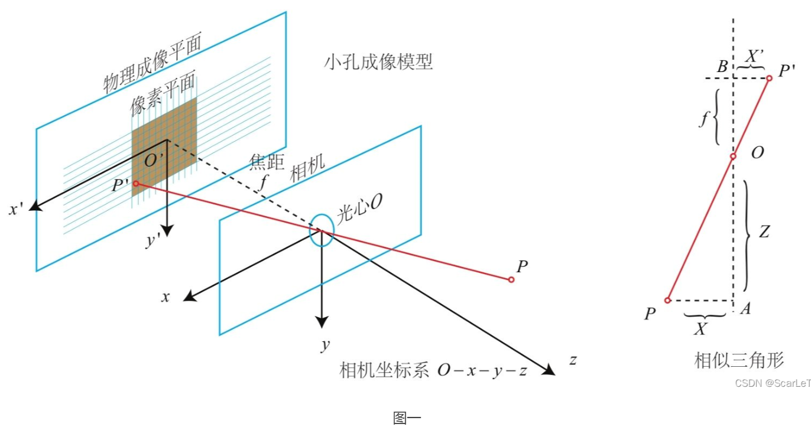

图二在二维坐标系下解释了针孔模型的过程，其中**归一化成像平面** 是指距离原点$O$ 的距离为单位1的坐标。设$P_s$ 为$P$ 在归一化成像平面上的投影点，其坐标为$[X_s, Y_s, 1]^T$ ，有：$\frac{Z}{1} = \frac{X}{X_s} = \frac{Y}{Y_s}$ .

整理得：$X_s = \frac{X}{Z},Y_s = \frac{Y}{Z}$ 

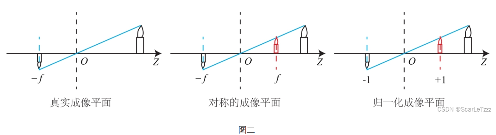

我们知道，相机拍摄的数字图像是以二维矩阵存储的，他的坐标以**像素**为单位，而且坐标原点一般在图像的左上角，而实际物理图像的坐标原点在图像中心，坐标单位为**米** 。其关系如图三所示，$O_{pixel}-u-v$ 为**像素坐标系**，$O_{image}-x_{image}-y_{image}$ 为图像坐标系。

假设x轴方向有$1(m) = \alpha(pixel)$，y轴方向有$1(m)=\beta(pixel)$ ，那么$P'$ 点的像素坐标$(u,v)$ 有下面的关系：
$$
\begin{cases}
 u = \alpha X' = \alpha f \frac{X}{Z}\\
 V = \beta Y' = \beta f \frac{Y}{Z}\\
 \end{cases} 令
 \begin{cases} 
 f_x = \alpha f \\
 f_y = \beta f.
 \end{cases} 则写成矩阵形式有：
 \begin{bmatrix}
 u\\
 v\\
 1\\
 \end{bmatrix}=\begin{bmatrix}
 f_x&0&c_x\\
 0&f_y&c_y\\
 0&0&1\\
 \end{bmatrix}\frac{1}{Z}\begin{bmatrix}
 X\\
 Y\\
 Z\\
 \end{bmatrix}
$$

$$
其中 \frac{1}{Z}\begin{bmatrix}
 X\\
 Y\\
 Z\\
 \end{bmatrix} = \begin{bmatrix}
 X_s\\
 Y_s\\
 1\\
 \end{bmatrix}=P_s,令K=\begin{bmatrix}
 f_x&0&c_x\\
 0&f_y&c_y\\
 0&0&1\\
 \end{bmatrix}，那么K为相机的内参矩阵，它为归一化坐标与像素坐标的映射关系：
$$


$$
P_{pixel} = KP_s
$$


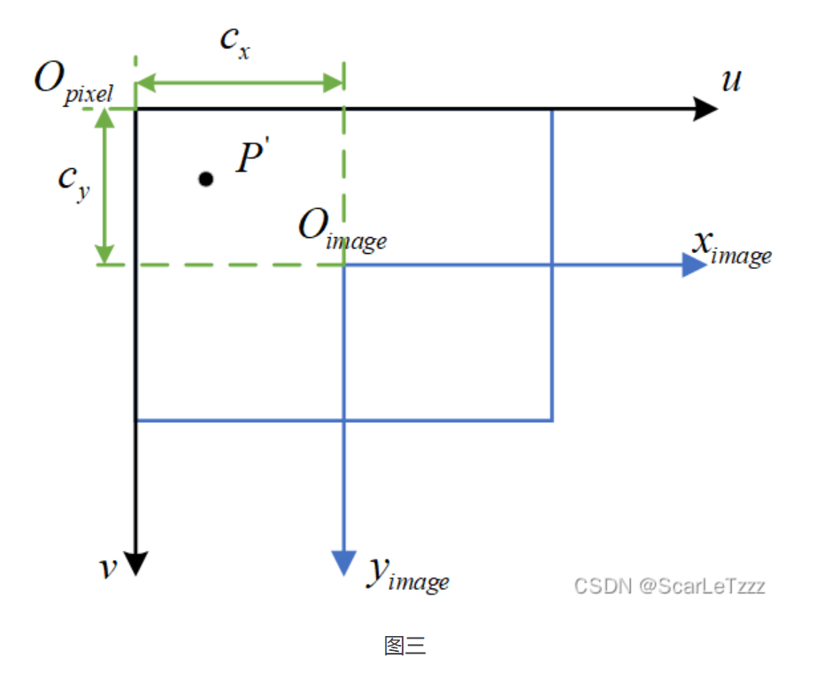


### 各坐标系之间的转换

 在相机的成像模型和三维重建原理中都存在坐标系的转换，我们可以从上面的相机模型中深刻的体会到这一点。坐标转换涉及的坐标系主要有：**世界坐标系、相机坐标系、归一化坐标系、图像坐标系、像素坐标系**这五大坐标系。

#### 各坐标系定义

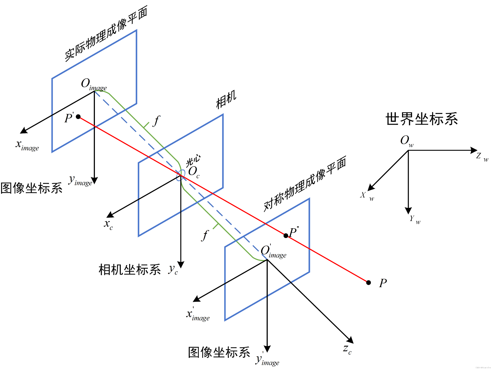

图九

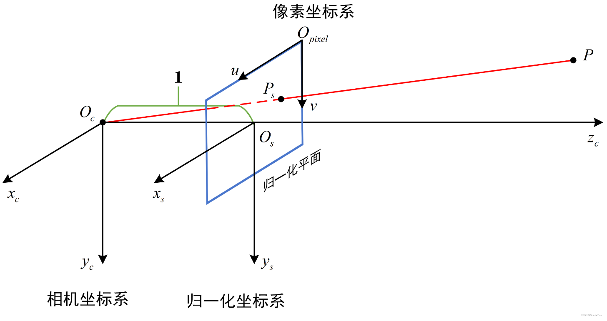

图十

**世界坐标系(world coordinate system**)：用户定义的三维世界的坐标系，坐标原点由用户自定义，为了描述目标物在真实世界里的位置而被引入。单位为m 。如图九中$O_w-x_w-y_w-z_w$ 。

**相机坐标系(camera coordinate system)**：在相机上建立的坐标系，以光心为坐标原点，光轴为z zz轴为了从相机的角度描述物体位置而定义，作为沟通世界坐标系和图像/像素坐标系的中间一环。单位为m。如图九中$O_c-x_c-y_c-z_c$。

**归一化坐标系(scaled coordinate system)**：在z zz轴正半轴上到原点距离为1，为了消去空间上某一点的深度信息，作为沟通世界坐标系和图像/像素坐标系的中间一环。单位为1。如图十中$O_s-x_s-y_s$ 。

**图像坐标系(image coordinate system)**：为了描述成像过程中物体从相机坐标系到图像坐标系的投影透射关系而引入，方便进一步得到像素坐标系下的坐标。 单位为m。如图九中 $O_{image}-x_{image}-y_{image}$ 。

**像素坐标系(pixel coordinate system)**：为了描述物体成像后的像点在数字图像上（相片）的坐标而引入，是我们真正从相机内读取到的信息所在的坐标系。单位为pixel。如图十中$O_{pixel}-u-v$ .

### 各坐标系之间的相互转换模型

 按照下面的流程进行转换：


（1）世界坐标系->相机坐标系

刚体变换(regidbody motion)：三维空间中，当物体不发生形变时，对一个几何物体作旋转 R， 平移 t 的运动，称之为刚体变换。世界坐标系到相机坐标系的变化就是刚体变换，又因为R 和t与相机无关，所有又称其为相机外参。
$$
\begin{bmatrix}
 X_c\\
 Y_c\\
 Z_c\\
 1
 \end{bmatrix} =\begin{bmatrix}
 R&t\\
 0^T&1\\ 
 \end{bmatrix}\begin{bmatrix}
 X_w\\
 Y_w\\
 Z_w\\
 1
 \end{bmatrix}
$$


## 相机矩阵分解

[相机矩阵(Camera Matrix)-CSDN博客](https://blog.csdn.net/zb1165048017/article/details/71104241)

[What Is Camera Calibration? - MATLAB & Simulink - MathWorks 中国](https://ww2.mathworks.cn/help/vision/ug/camera-calibration.html)

[Perspective Camera Toy ← (ksimek.github.io)](http://ksimek.github.io/perspective_camera_toy.html)

- 相机矩阵的表示？缺点？

假设有一个$3*4$ 的相机矩阵，可以将齐次3D坐标转换为2D图像坐标。矩阵表示如下：
$$
P = [M|-MC]
$$
这里的'|'代表的是增广矩阵。其中$M$代表可逆$3*3$ 矩阵，$C$是列向量，代表世界坐标系中的相机位置。

相机矩阵可以将3D点投影到2D空间，但是有些缺点：

- - 没有提供相机的摆放姿态；
  - 没有提供相机内部几何特征；
  - 不能使用江面光照，因为无法在相机坐标系中得到表面法线向量。

### 相机矩阵分解

为了解决上述问题，可以将相机矩阵分解为两个矩阵的乘积：内参矩阵$K$ 和外参矩阵$[R|-RC]$ 
$$
P = K[R|-RC]
$$
其中，$3*3$ 的上三角阵$K$ 描述了相机的内参，比如焦距；$3*3$ 的旋转矩阵$R$ 的列表示相机参考帧的世界坐标轴方向；向量$C$ 是世界坐标系中的相机中心。那么向量$t=-RC$ 就给出了相机坐标系中的世界原点位置。我们需要做的就是且介这些参数，当然，前提是我们已经知道$P$ 了。

### 相机中心

相机中心的求解比较简单，利用分解前的相机矩阵，由于$P$ 的最后一列是由$-MC$ 得到的，而$M$ 在原始的相机矩阵的前$3*3$ 部分已经给出了，所以只需要用$-M^{-1}$ 左乘它即可。

### 旋转矩阵和内参

首先注意旋转矩阵$R$ 是正交的，因为每一列代表的是一个轴；而内参矩阵$K$ 是一个上三角阵。然后考虑到$QR$ 分解的用途就是将一个满秩矩阵分解为一个上三角阵和正交阵的乘积。matlab代码如下

```matlab
function [R Q] = rq(M)
    [Q,R] = qr(flipud(M)')
    R = flipud(R');
    R = fliplr(R);
    Q = Q';   
    Q = flipud(Q);

```


但是发现$QR$ 分解的结果不唯一，对$K$ 的任何一列以及$R$ 的对应行取反都不会导致相机矩阵结果改变。

如果满足如下两个条件，可以让$K$ 的对角元为证。

- 图像$X/Y$ 轴所指方向与相机的$X/Y$ 轴方向相同；
- 相机处于z轴正方向；

所以可以取$QR$ 分解中，使得$K$ 的对角元为正的解，让$K$ 对角元为正的代码如下：

```matlab
# make diagonal of K positive
T = diag(sign(diag(K)));
K = K * T;
R = T * R; # (T is its own inverse)

```

然而在实际中，照相机和图片的轴经常不统一，所以$K$的对角元也不应该是正的，如果强制它们为正，将会导致一些不好的副作用，包含：

- 对象位于相机错误的一边;
- 旋转矩阵行列式为− 1 -1−1而不是1 11;
- 不正确的镜面光照( specular lighting);
- 出现视觉几何无法被渲染问题，原因在于具有负的w坐标

如果从全正的对角元开始，你需要做的就是：

- 如果图像x轴和摄像机x轴指向相反方向，将K KK的第一列以及R RR的第一行取反;
- 如果图像y轴和摄像机y轴指向相反方向，将K KK的第二列以及R RR的第二行取反;
- 如果相机俯视是z轴负方向，将K KK的第三列以及R RR的第三行取反。
- 如果R RR的行列式置为− 1 -1−1，将它取反;

以上每一步都能保证相机矩阵不变，最后一步等价于将整个相机矩阵$P$乘以$-1$。因为P PP的操作是基于齐次坐标系的，所以将它乘以任何的常量都无影响。

当然可以使用向量$t = − R C $去检查结果，此式代表的是在相机坐标系中的世界坐标系原点。如果都没错，那么$t_x,t_y,t_z$ 应该能够反映出世界原点在相机中的位置（分别ie之处在中心左边/右边，上边/下边， 相机的前面/后面）。


## 三线性插值

[三线性插值(Trilinear Interpolation)详解-CSDN博客](https://blog.csdn.net/weixin_42546737/article/details/110850247)

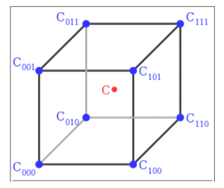
$$
\begin{aligned}
x_d &= (x-x_0)/(x_1-x_0) \\
y_d &= (y-y_0)/(y_1-y_0) \\
z_d &= (z-z_0)/(z_1-z_0) \\
\end{aligned}
$$


- x0表示在x下方一个方格点，x1表示在x上方的一个方格点，对于y0、y1、z0、z1是同样的意思。
  xd、yd、zd表示x、y、z在较小相关坐标的差值（这是维基百科中的解释，我认为他相当于是一个权值）
- 首先，我们沿着x轴方向插值

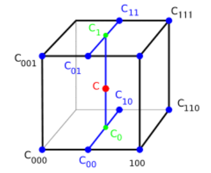


$$
\begin{aligned}
c_{00} &= V[x_0,y_0,z_0](1-x_d)+V[x_1,y_0,z_0]x_d \\
c_{01} &= V[x_0,y_0,z_1](1-x_d)+V[x_1,y_0,z_1]x_d \\
c_{10} &= V[x_0,y_1,z_0](1-x_d)+V[x_1,y_1,z_0]x_d \\
c_{11} &= V[x_0,y_1,z_1](1-x_d)+V[x_1,y_1,z_1]x_d 
\end{aligned}
$$

- V[x0,y0,z0]表示该函数在（ x0,y0,z0)上的值
- 然后再沿着y轴插值

$$
\begin{aligned}
c_0 = c_{00}(1-y_d) + c_{10}y_d \\
c_1 = c_{01}(1-y_d) + c_{11}y_d
\end{aligned}
$$


- 最后再沿着z轴插值

$$
c= c_0(1-z_d) + c_1z_d
$$

如此我们就得到了一个点的值。三线性插值的结果与沿三个轴的插值步骤的顺序无关：任何其他顺序，例如沿x，然后沿y，最后沿z，产生相同的值。

**根据以上推导公式我们可以得到一个完整的公式**
$$
\begin{aligned}
c = &V[x_0,y_0,z_0](1-x_d)(1-y_d)(1-z_d) + V[x_1,y_0,z_0]x_d(1-y_d)(1-z_d) \\
&V[x_0,y_0,z_1](1-x_d)(1-y_d)z_d + V[x_1,y_0,z_1]x_d(1-y_d)z_d \\
&V[x_0,y_1,z_0](1-x_d)y_d(1-z_d) + V[x_1,y_1,z_0]x_dy_d(1-z_d) \\
&V[x_0,y_1,z_1](1-x_d)y_dz_d + V[x_1,y_1,z_1]x_dy_dz_d \\
\end{aligned}
$$

