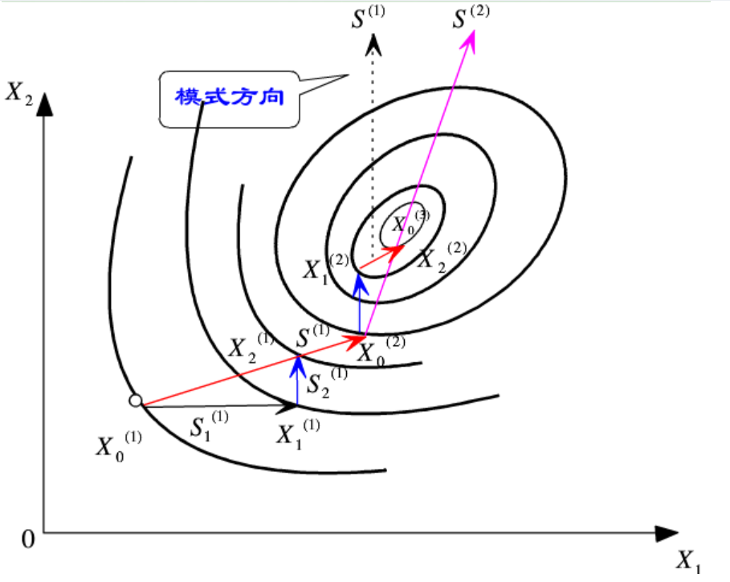
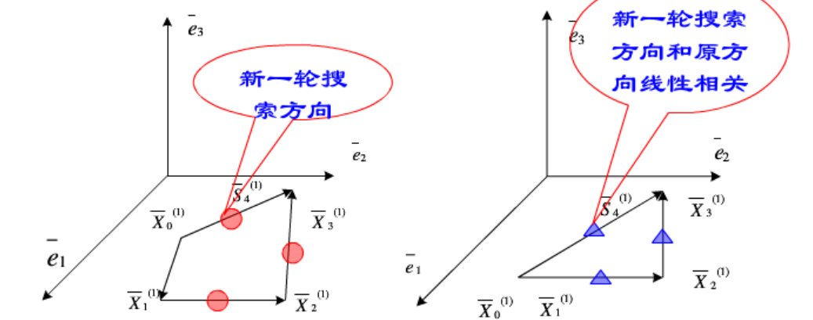
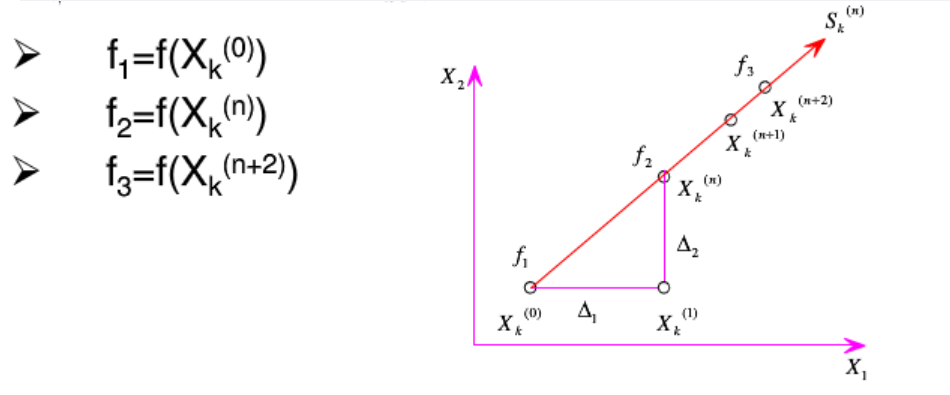

优化算法：powell(不依赖梯度)、cmaes(基于进化的方法)


模板

| 论文     | 描述 |
| -------- | ---- |
| 名称     |      |
| 论文链接 |      |
| 项目链接 |      |
| 作者     |      |
| 单位     |      |
| 发表日期 |      |
| 摘要     |      |
| 关键词   |      |

## Powell

[深度理解Powell优化算法_powell法-CSDN博客](https://blog.csdn.net/shenziheng1/article/details/51028074#:~:text=鲍威尔法又称方向加速法，它由Powell于1964年提出，是利用共轭方向可以加快收敛速度的性质形成)

### Powell优化方法综述

鲍威尔法又称方向加速法，它由Powell于1964年提出，是利用共轭方向可以加快收敛速度的性质形成的一种搜索方法。该方法不需要对目标函数进行求导，当目标函数的导数不连续的时候也能应用，因此，鲍威尔算法是一种十分有效的直接搜索法。
Powell法可用于求解一般无约束优化问题，对于维数n<20的目标函数求优化问题，此法可获得较满意的结果。
不同于其他的直接法，Powell法有一套完整的理论体系，故其计算效率高于其他直接法。该方法使用一维搜索，而不是跳跃的探测步。同时，Powell法的搜索方向不一定为下降方向。

### 共轭方向的概念与共轭向量的性质

####  共轭方向

A为n阶实对称正定矩阵，若有两个n维向量S1和S2可以满足S1*AS2=0.则称向量S1与S2对矩阵A共轭，共轭向量的方向称为共轭方向。

#### 共轭向量的性质

设A为n×n阶实对称正定矩阵，Si（i=1,2,3,...,n）是关于A的n个相互共轭的非零向量，对于正定二次函数f(x)的极小化寻优问题，从任何初始点出发，依次沿Si方向经过n次一维搜索即可收敛到极小点X*=X(n)。
沿n元二次正定函数的n个共轭方向进行n次一维搜索就可达到目标函数的极小点。

### 原始Powell算法的基本思想及其弊端

#### 原始Powell算法基本思想及计算步骤

考虑正定二次函数的元约束最优化问题
$$
min f(x) = \frac{1}{2}\pmb{x}^TQ \pmb{x}+\pmb{b}^T\pmb{x}+c \\
其中\pmb{x} \in \mathbb{R}^{n \times n}为正定矩阵，\pmb{b} \in \mathbb{R}^n，c \in \mathbb{R}. \\
沿n个线性无关的方向 \\
\pmb{x_0}------- \rightarrow \pmb{x_1} \\
进行基本搜索和加速搜索 \\
\\
沿n个调整的搜索方向 \\
------ \rightarrow \pmb{x_2} \cdots \rightarrow \pmb{x^*} \\
进行基本搜索和加速搜索
$$

```bash
计算步骤：
Step1：选取初始数据。选取初始点x0,n个线性无关的搜索方向d0,d1,...dn-1，给定允许误差Err,令k>0;
Step2：进行基本搜索。令y0=x1，依次沿d0,d1,...,dn-1进行一维搜索。对一切j=1,2,...,n记f(y(j-1)+λ(j-1)d(j-1)) = min f(y(j-1)+λd(j-1)),
y(j) = y(j-1)+λ(j-1)d(j-1);
Step3：进行加速搜索。取加速方向d(n)=y(n)-y(0);若||d(n)||<Err,迭代终止，得到y(n)为问题的近似最优解；否则，点y(n)出发沿d(n)进行一维搜索，求出λ(n),使得f(y(n)+λ(n)d(n))=min f(y(n)+λd(n)).
记：x(k+1) = y(n)+λ(n)d(n)，转Step4.
Step4：调整搜索方向。在原来n个方向d(0),d(1),...,d(n-1)中，除去d0增添d(n),构成新的搜索方向，返回Step2.
```

#### Powell算法的迭代格式

原始的Powell法是沿着逐步产生的共轭方向进行一维搜索的。现在以二维二次目标函数为例来说明。



```bash
如上图所示，选定初始点X0(1),初始方向S1(1)=e1=[1,0]'；S2(1)=e2=[0,1]'；
第一轮循环：
初始点X0(1)---->(e1,e2)---->终点X2(1)---->生成新方向 S(1) = X2(1)-X0(1)；
第二轮循环：
初始点X0(2)---->(e2,S(1))---->终点X2(2)---->生成新的方向 S(2) = X2(2)-X0(2)；
通过上图我们会发现，点X0(2)、X2(2)是先后两次沿S(1)方向一维搜索到得极小点。由共轭性可以得到：连接X0(2)和X2(2)构成的矢量S(2)与S(1)对H共轭。
从理论上讲，二维二次正定函数经过这组共轭方向的一维搜索，迭代点以达到函数函数的极小值点X*。
`将此结构推广至n维二次正定函数，即依次沿n个（S(1)，S(2)，...，S(n)）共轭方向一维搜索就能达到极限值点。

```

### 原始Powell算法的特点

1.原始的Powell算法也是一种共轭方向法，由于它仅仅需要计算目标函数值而不必求导数值。因此Powell算法比普通的共轭方向法（共轭梯度法）更具实用性。
2.原始Powell算法可用于求解一般无约束优化问题。
3.然而，在原始的Powell算法中，必须保持每次迭代中前n搜索方向线性无关，否则将永远得不到问题的最优解。

### Powell算法缺陷

当某一循环方向组中的矢量系出现**线性相关**的情况（退化，病态）时，搜索过程在**降维**的空间进行，致使计算**不能收敛**而失败。



为了避免此种情况产生，提出了修正的Powell算法。

### 改进的Powell算法

#### 算法原理

为了避免鲍威尔法缺陷，Powell提出了相应的修正算法：




和原始的Powell算法的主要区别在于：

1. 在构成第k+1次循环方向组时，不用淘汰前一循环中的第一个方向S1(k)的办法，而是计算函数值，并根据是否满足条件进行计算。
2. 找出前一轮迭代法中函数值下降最多的方向m以及下降量△m，即：

$$
\begin{aligned}\Delta_m &= max\{ [f(X_k^{(i)}) - f(X_k^{(i+1)})] \quad (i = 0, 1, \cdots, n-1)\} \\
&= f(X_K^{(m-1)}) - f(X_K^{(m)})
\end{aligned}
$$

 可以证明：若f3 < f1;
$$
(f_1 - 2f_2 + f_3)(f_1-f_2-\Delta_m)^2 \lt 0.5 \Delta_m(f_1 - f_3)^2
$$


同时成立。

表明方向Sk(n)与原方向组成线性无关，可以用来替换对象△m所对应的方向Sk(m)。否则仍然用原方向组进行第k+1轮搜索。

#### 改进Powell算法计算步骤

> Step1：选取初始数据。选取初始点x0,n个线性无关的初始搜索方向d0,d1,...,dn-1;给定允许误差Err>0,令k=0;
> Step2：进行基本搜索。令y0=x(k),依次沿d0,d1,...,dn-1进行一维搜索。对一切j=1,2,...,n，记f(y(j-1)+λ(j-1)d(j-1)) = minf(y(j-1)+λd(j-1))，     y(j) = f(y(j-1)+λ(j-1)d(j-1)) ;
> Step3：检查是否满足终止条件。取加速度方向d(n)=y(n)-y(0);若||d(n)||<Err,迭代终止，得yn为问题的最优解；否则    转Step4。
> Step4：确定搜索方向，按照上式公式确定m，若验证式子成立，转Step5；否则，转Step6。
> Step5：调整搜索方向。从点yn出发沿方向dn进行一维搜索，求出λn,使得f(yn+λn*dn)=min f(yn+λ*dn);令                               x(k+1)=yn+λn*dn。再令d(j)=d(j+1)，j=m,m+1,...,n-1.k=k+1,返回Step2。
> Step6：不调整搜索方向，令x(k+1)=yn; k=k+1,返回Step2。

  

#### 典型例题

用修正的Powell算法求$f(x)=x1*x1+2*x2*x2-4*x1-2*x1*x2$的最优解。X0=[1,1]';收敛精度Err=0.001。

解：X0(1)=X0=[1,1]'；f1=f(x0(1))=-3;


沿坐标轴方向向S1=[1,0]方向进行一维搜索:
X1(1) = X0(1)+a(1)*S1(1) = [1,1]'+a1(1)[1,0]'=[1+a1(1),1]'
将X1(1)带入上式，求导可以确定a1(1)=2时，得到极小值。此时，X1(1)=[3,1]; f(X1(1))=-7。
沿坐标轴方向向S2=[0,1]方向进行一维搜索:
X2(1) = X1(1)+a2(1)*S2(1) = [3,1]'+[0,a2(1)]'=[3,1+a2(1)]'。
将X2(1)代入上式，求导可以确定a2(1)=1/2,得到极小值。此时，X2(1)=[3,1.5]; f(X2(1))=-7.5。
检验是否满足终止迭代条件||X2(1)-X0(1)|| = 2.06>Err.
计算各个方向上的函数下降量：
△1=f(X0(1))-f(X1(1))=4;
△2=f(X1(1))-f(X2(1))=0.5;
△m=max{4,0.5}=4;
映射点：
X(1) = 2X2(1)-X0(1)=2*[3,1.5]'-[1,1]=[5,2];
`条件验证：f3=f(X(1))=-7, f3<f1
(f1-2f2+f3)(f1-f2-△m)^2 = 1.25 < △m/2*(f1-f3)^2 =32 满足。
因此，得到新的搜索方向：S(1)=X2(1)-X0(1)=[3,1.5]-[1,1]=[2,1.5]';`

沿S(1)方向再次做一维搜索：
X3(1)=X2(1)+a3(1)*S(1)=[3,1.5]+a3(1)[2,1.5] = [3+2*a3(1),1.5+1.5a3(1) ];
     当a3(1)=0.4时，取得极小值。此时，X3(1)=[19/5,17/10]; f(X3(1)) = -7.9。

`以X0(2) = X3(1)作为新的起点，沿(e2,S(1))方向进行一维搜索，开始进入第二个循环：`
X2(0)=[19/5,17/10]; f(X2(0))=-7.9;
沿e2=[0,1]方向进行一维搜索：
X1(2) = [19/5,19/10]; f(X1(2))=-7.98 
沿S(1)=[2,1.5]方向进行一维搜索:
X2(2) = [99/25,97/50];  f(X2(2)) =-7.996
检验：||X2(2)-X2(0)|| = 0.288>Err
继续进行迭代：△1=0.08;
 △2=0.016;
 △m=0.08;
`映射点：X(2)=2*X2(2)-X0(2)=[103/25,109/50]; f(X(2))=-7.964>f1 条件不满足。
新的方向：S(2)=[99/25,97/50]-[19/5,17/10]=[4/25,12/50];`

`进行继续迭代时，取X3(0)=X2(2)，沿着(e2,S(1))方向一维搜索进行第三轮循环：`
X3(1)=[99/25,99/50] ; f1=-7.9992;
X3(2)=[3.9992,1.988]; f2=-7.99984;
检验：||X2(3)-X0(3)||=0.0577 >Err;
X(3)=[4.024,2.036]'; f3=-7.99856;  f3>f1.
`由于S(1)即S(2)为共轭方向，目标函数是二次函数，若沿S(2)方向进行一维搜索得到
X(2)=[4,2]，F(X(2))=-8，此为目标函数的最优解。`


## CMA-ES


协方差矩阵自适应进化策略（CMA-ES）是一种特殊的数值优化策略。进化策略（ES）是用于非线性或非凸连续优化问题数值优化的随机、无导数方法。它们属于进化算法和进化计算的范畴。进化算法广泛基于生物进化的原理，即变异（通过重组和突变）和选择的重复相互作用：在每一代（迭代）中，新的个体（候选解决方案，表示为$x$ ）是由当前父母个体的变化产生的，通常是以随机的方式。然后，根据他们的适应度或目标函数值$f(x)$，选择一些个体成为下一代的父母。像这样，在生成序列上生成拥有越来越好的$f$-值的个体。

在进化策略中，新的候选解通常根据从$\mathbb{R}^n$ 空间的多变量正态分布中采样。重新组合相当于为分布选择一个新的平均值。突变相当于为分布添加一个新的随机向量。